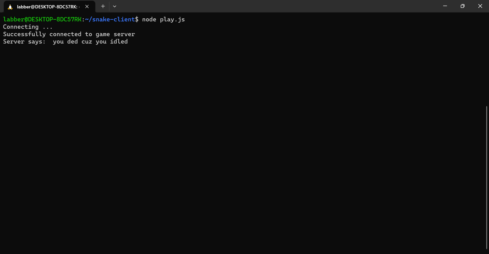
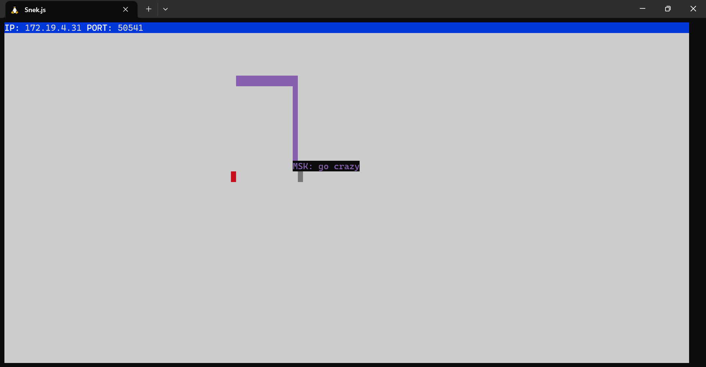

# Snake Client Project

Snake game is a very popular video game. It is a video game concept where the player maneuvers a dot and grows it by ‘eating’ pieces of food. As it moves and eats, it grows and the growing snake becomes an obstacle to smooth maneuvers. The goal is to grow it to become as big as possible without bumping into the side walls, or bumping into itself, upon which it dies.

This is simply a multiplayer take on the genre.

Before you can run this client, you will need to be running the server side which you can download and install from here. 

## Final Product

Client terminal image: After running `node play.js` in the client terminal and when successfully connected to the server it prints a  message `"Successfully connected to game server"`. You can see a message sent to you from the server when it kicks out your snake for idling... `"you ded cuz you idled"`.

Server terminal image: After connected to the server user can see the snake appears on the terminal window with user's name(initials) next to the snake. Now you can press the movement commands<kbd>w</kbd> : `Move up`, <kbd>a</kbd> : `Move left`, <kbd>s</kbd> : `Move down`, <kbd>d</kbd> : `Move right`to move the snake. As it moves and eats food, it grows. You can send a messages using special keys <kbd>x</kbd>, <kbd>z</kbd>.
Can be terminate game using <kbd> ctrl + c </kbd>

## Getting Started

- Follow steps inside the snek server repo to run the server side
  https://github.com/lighthouse-labs/snek-multiplayer
- Run the development snake client using the `node play.js` command.

